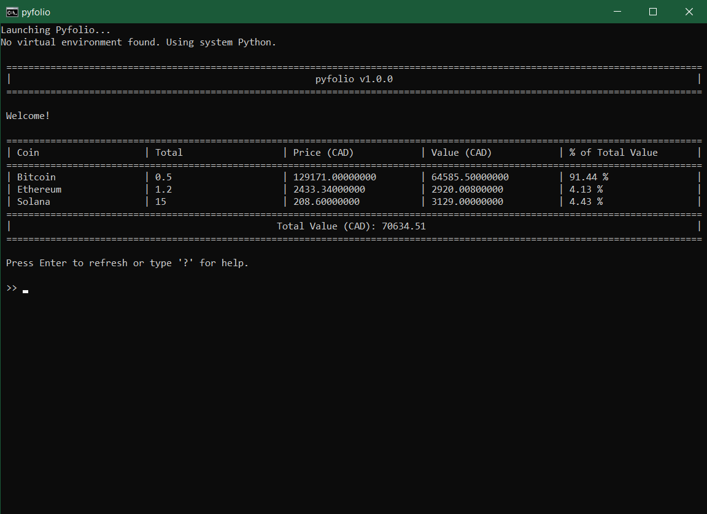

# pyfolio

**Version:** v1.1.0  
**License:** MIT

---

## Overview

pyfolio is a lightweight command-line cryptocurrency portfolio tracker that retrieves live pricing data using the [CoinGecko API](https://www.coingecko.com/en/api). It displays the value and distribution of your holdings in a clean, dynamically formatted terminal table.

This project is intended for developers, crypto enthusiasts, and anyone looking for a simple terminal-based portfolio viewer without third-party accounts or bloat.

---



---

## Features

- Real-time cryptocurrency pricing via CoinGecko  
- Portfolio total and per-coin breakdown  
- Configurable display currency  
- Input validation and error handling for user commands and API responses   
- Early warnings for empty portfolio or config files  
- Minimal dependencies and quick startup  
- Windows `.bat` launcher for fast access  

---

## Setup

### 1. Clone the repository:
```bash
git clone https://github.com/samkrichard/pyfolio.git
cd pyfolio
```

### 2. Set up Python (optional but recommended):
```bash
python -m venv venv
venv\Scripts\activate  # Windows
pip install pycoingecko
```

### 3. Run the application:
- Using the launcher (Windows only):
  ```bash
  pyfolio.bat
  ```
- Or directly:
  ```bash
  python pyfolio.py
  ```

---

## Configuration

### portfolio.json  
Specify the assets and quantities in your portfolio:
```json
{
  "bitcoin": 0.5,
  "ethereum": 1.2,
  "solana": 15
}
```

### config.json  
Set your default display currency:
```json
{
  "default_currency": "cad"
}
```

---

## Commands

| Command               | Description                                      |
|-----------------------|--------------------------------------------------|
| help / h / ?          | Display help information                         |
| currency / c          | Change the current display currency              |
| price / p             | View the price of a cryptocurrency               |
| all-in / ai / a-i     | Convert your portfolio entirely into one asset   |
| exit / e              | Exit the program                                 |

> ⚠️ Note: The alias `a` for `all-in` has been removed to prevent conflicts with future commands.

---

## Roadmap

- Add rate limiting to avoid API throttling
- Improved decimal formatting for Bitcoin and other crypto based valuations 

---

## License

Distributed under the MIT License.  
This project uses [pycoingecko](https://github.com/man-c/pycoingecko), which is also licensed under the MIT License.

---

## Credits

- [pycoingecko](https://github.com/man-c/pycoingecko) — Lightweight Python wrapper for the CoinGecko API  
- [CoinGecko](https://www.coingecko.com/) — Public access to live cryptocurrency pricing data

